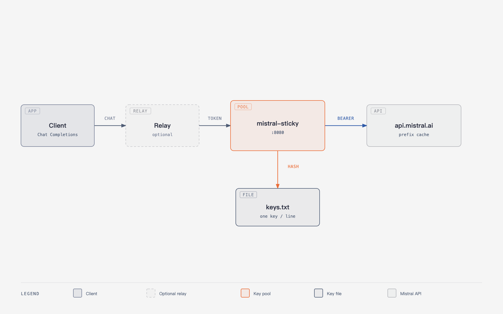

# mistral-sticky

[English](README.md) | [中文](README.zh.md)

[](https://github.com/IM594/mistral-sticky/actions/workflows/ci.yml)

mistral-sticky is a sticky key pool for the [Mistral API](https://docs.mistral.ai/). Clients authenticate with a single `PROXY_TOKEN`. Each conversation is pinned to one key from `keys.txt` and forwarded to `api.mistral.ai`.

Mistral [prefix cache](https://docs.mistral.ai/studio-api/conversations/advanced/prompt-caching) is scoped to the API key. Cached prompt tokens are billed at 10% of input. A relay that picks a random key every turn will not hit that cache.



```bash
docker pull ghcr.io/im594/mistral-sticky:latest
```

linux/amd64 and linux/arm64. Keys are mounted at runtime and must not be copied into the image.

## Features

- Session-hashed key selection (`hash % N` over `keys.txt`)
- Stable `prompt_cache_key` written on the upstream request
- Deterministic mapping of tool-call ids to Mistral's 9-character alphabet
- OpenAI-only fields stripped (`reasoning_effort: medium`, `stream_options`, …)
- 401/403: that key is cooled for 30 days
- 429: the same key is kept

## Example

Five turns of one agent session, same key:

| turn | prompt tokens | `cache_tokens` |
| ---: | ------------: | -------------: |
| 1    |         14584 |              0 |
| 2    |         14608 |          14464 |
| 3    |         14677 |          14592 |
| 4    |         14796 |          14592 |
| 5    |         14854 |          14720 |

Turns 2–5 reused about 79% of the prompt from cache.

## Installation

```bash
cp .env.example .env
mkdir -p data
cp keys.example.txt data/keys.txt
printf '{"entries":[]}\n' > data/cooldown.json
sudo chown -R 65532:65532 data
docker compose up -d
```

Set `PROXY_TOKEN` in `.env`. Put one official Mistral key per line in `data/keys.txt`. Do not commit either file. The image runs as uid 65532.

Default listen address is `127.0.0.1:8080`. Pin a release with `ghcr.io/im594/mistral-sticky:v0.1.2`. `keys.txt` is append-only; do not reorder or delete lines in the middle.

To join an existing Docker network, edit the name in `docker-compose.external-network.yml`:

```bash
docker compose -f docker-compose.yml -f docker-compose.external-network.yml up -d
```

## Usage

```bash
curl -s http://127.0.0.1:8080/healthz
curl http://127.0.0.1:8080/v1/chat/completions \
  -H "Authorization: Bearer $PROXY_TOKEN" \
  -H "Content-Type: application/json" \
  -d '{"model":"mistral-small-latest","messages":[{"role":"user","content":"ping"}]}'
```

Any Chat Completions client can use this as the Mistral base URL. If another proxy sits in front, point that proxy at `http://mistral-sticky:8080` and keep official keys only in `keys.txt`. Do not rewrite the JSON body in front of sticky; changing tool-call ids each turn breaks the prefix.

## Agent instructions

Copy the following block into an AI agent:

```
Deploy https://github.com/IM594/mistral-sticky on this machine.

mistral-sticky is a Mistral key pool. Clients authenticate with PROXY_TOKEN. Official API keys live in data/keys.txt. Keys are chosen by session hash so one conversation stays on one key and Mistral prefix cache can hit (cached tokens bill at 10% of input). Image: ghcr.io/im594/mistral-sticky:latest (linux/amd64, linux/arm64). Do not copy keys.txt or .env into the image or commit them.

Follow docker-compose.yml in the repository:
1. Copy .env.example to .env and set PROXY_TOKEN to a random secret.
2. mkdir -p data; write one official key per line to data/keys.txt; printf '{"entries":[]}\n' > data/cooldown.json.
3. chown -R 65532:65532 data (the image runs as uid 65532).
4. docker compose up -d. Default bind is 127.0.0.1:8080.
5. Point any Chat Completions client at this service with Authorization: Bearer PROXY_TOKEN. If another proxy sits in front, set that proxy's Mistral base URL to http://mistral-sticky:8080 on the shared Docker network. Official keys stay in sticky's keys.txt. Do not rewrite request bodies in front of sticky.
6. keys.txt is append-only. Do not rotate on 429. Logs may include key_index and session_fp; never log the raw key or Authorization.

See README.md. Verify with curl /healthz and one /v1/chat/completions request.
```

## Configuration

| Variable | Description |
|---|---|
| `PROXY_TOKEN` | Inbound bearer secret |
| `KEYS_FILE` | Official keys, one per line (default `/data/keys.txt`) |
| `COOLDOWN_FILE` | Disabled indexes and expiry only |
| `UPSTREAM` | Default `https://api.mistral.ai` |
| `LISTEN` | Default `:8080` |

See `.env.example`.

## Build from source

```bash
go test ./...
go run ./cmd/mistral-sticky
```

## License

MIT
